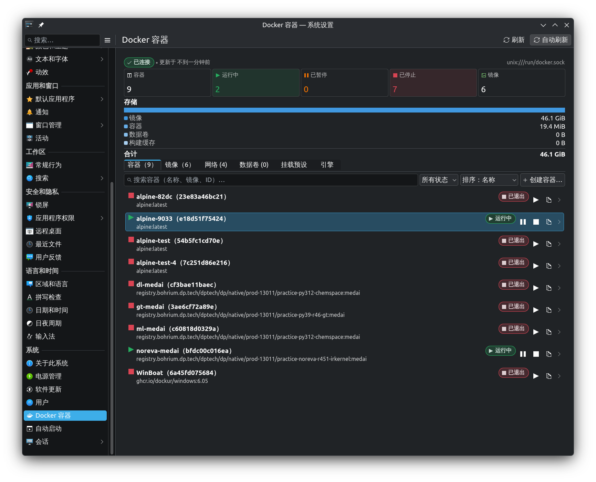

# kcm-docker

kcm-docker is a Docker dashboard for KDE Plasma 6: containers, images, networks, volumes and engine status, all inside System Settings.

## Introduction

kcm-docker is a KCM (KDE Configuration Module) that brings a complete Docker dashboard into System Settings:

- **Reading is always safe.** Connection state, containers, images, networks, volumes, container logs, resource usage and disk usage.
- **Writing follows the actual permissions of the Docker socket.** Start, stop and remove containers, pull and build images, create networks and volumes — those entries only appear when the socket is writable for the current user. Otherwise the UI explains why instead of failing silently.
- **The only privileged surface is strictly limited.** A helper with a hard whitelist: it can write `/etc/docker/daemon.json` and start, stop or restart `docker.socket`, `docker.service` and `containerd.service` — nothing else.
- **Registry credentials live in KWallet first**, and are mirrored in the Docker CLI format to `~/.docker/config.json` (a user-writable file, mode `0600`).



## Features

| Area | What you get |
| --- | --- |
| Containers | List with search, state filter and sorting; detail view (overview, resources, network, mounts, logs); start / stop / restart / pause / remove; **streaming logs** with follow, pause, clear and copy |
| Create container | Step-by-step wizard (image → basics → environment → interactive → ports → mounts → resources → review), read-only review page, **mount presets** (edit, reorder, favourite) and cloning from an existing container |
| Images | List and detail view; pulling (several at once, progress per pull, cancellation, engine message kept on failure); removing one tag or all tags; **building from a Dockerfile** (honours `.dockerignore`, points at the failing step) and pruning the build cache |
| Networks | List and detail view (subnet, gateway, member containers with jump-to-container); creating bridge networks; removing; connecting and disconnecting containers, with aliases |
| Volumes | List and detail view; creating, removing and pruning unused volumes |
| Port mappings | Chip and line topology: several host addresses of one container port collapse into a single branch, and IPv4/IPv6 wildcard bindings become one **double-ring** node; conflicts are caught while creating a container, naming the container that holds the port and suggesting a free one |
| Engine | Engine and API version, operating system, kernel, cgroup, storage driver, **component versions (dockerd, containerd, runc, …)**, engine warnings, and a services card with state plus restricted start / stop / restart / enable / disable |
| Registry credentials | Stored in KWallet, written only after the registry accepted them, token login supported, and kept in sync with `~/.docker/config.json` |

## Dependencies

**Build dependencies**

- Qt 6.5+ (Core, Gui, Qml, Quick, Widgets, DBus, Network)
- KDE Frameworks 6.5+: KCoreAddons, KConfig, KI18n, KCMUtils, KIO, KArchive, KAuth, KWallet
- Kirigami 6, Extra CMake Modules, CMake 3.20+, a compiler with C++20 support

**Runtime dependencies**

- A working Docker engine — this is the interface, not the engine
- `polkit` for the privileged actions and `kirigami` for the UI; optionally `breeze-icons` for the module icon (`folder-docker`)

## Building and installing

```sh
cmake -B build -DCMAKE_BUILD_TYPE=Release
cmake --build build
cmake --install build          # installs into CMAKE_INSTALL_PREFIX
```

**The privileged helper has to be installed once, separately.** The helper binary, the polkit policy, the D-Bus activation file and the system bus policy all live in system paths, and `cmake --install` deliberately leaves them alone (installing into a development prefix should not require root):

```sh
sudo build/install-privileged-helper.sh            # install
                                                   # (also removes the files of the former name, kontainer)
sudo build/install-privileged-helper.sh uninstall  # remove
```

Distributions install everything in one go instead, using KAuth's own macros:

```sh
cmake -B build -DCMAKE_INSTALL_PREFIX=/usr -DKCM_DOCKER_INSTALL_PRIVILEGED_HELPER=ON
sudo cmake --install build
```

## Usage

```sh
systemsettings kcm_docker     # open it inside System Settings
kcmshell6 kcm_docker          # standalone window: logs go straight to the terminal
```

The module sits under *System Settings → System Administration → Docker Containers*, and searching for “container”, “docker” or “image” finds it.

> Architecture and debugging notes (including how to investigate a crash) are kept in the maintainer's local source tree and are not part of the repository; ask the maintainer if you need them.

## Permissions

| Action | What it needs |
| --- | --- |
| Viewing state, lists, details and logs | A readable Docker socket |
| Starting, stopping and removing containers, pulling and removing images, creating networks and volumes, … | A Docker socket **writable** by the current user |
| Editing the daemon configuration, starting and stopping the Docker services | The restricted helper plus polkit authorisation (asks for the administrator password, and keeps the authorisation for a few minutes) |

The helper accepts **whitelisted actions on whitelisted units only**, and both the session side and the helper validate that whitelist, so no arbitrary service name or command can be passed through.

## Getting involved

- **Reporting a bug:** please include the output of `kcmshell6 kcm_docker` from a terminal (requests, state changes and errors are logged there), your Docker version and your distribution. For anything privileged, mention whether `install-privileged-helper.sh` has been run.
- **Code style:** follow the layering and comment style of the surrounding files. New behaviour needs tests, and **the important ones need a negative test** that fails when the behaviour is broken. `-Wall -Wextra` has to stay at zero warnings.
- **Tests:** `cmake -B build && cmake --build build && ctest --test-dir build` (add `QT_QPA_PLATFORM=offscreen` when there is no display).
- **Translations:** all user-visible strings go through `i18n()`; after changing strings, regenerate `po/kcm_docker.pot` and update `po/*.po` (a test checks that the template matches the sources).

## License

kcm-docker is released under the **GPL-2.0-or-later**. Every source file carries an SPDX header:

```cpp
/*
    SPDX-FileCopyrightText: 2026 kcm-docker developers

    SPDX-License-Identifier: GPL-2.0-or-later
*/
```
